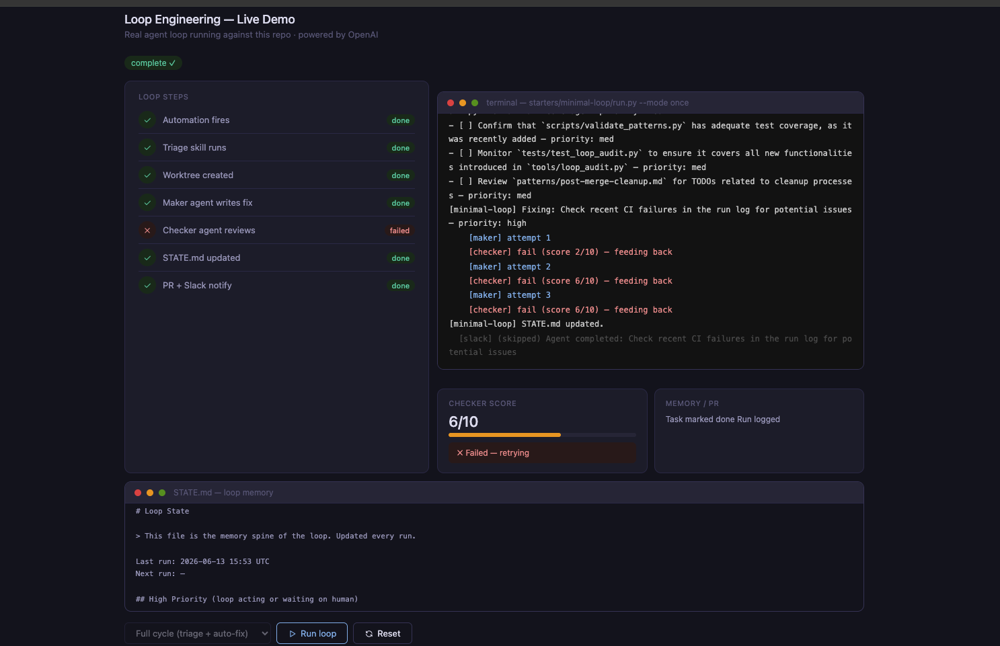

# Loop Engineering (Python)

**Loop engineering is replacing yourself as the person who prompts the agent.  
You design the system that does it instead.**

A Python-native reference repo for loop engineering — practical patterns, runnable starters, and
skills you can clone and adapt. Works with **Ollama (local/free)** or **OpenAI API**.

> Inspired by Addy Osmani's essay and the cobusgreyling/loop-engineering reference repo.

---

## Quick Start (5 minutes)

```bash
# 1. Install deps
pip install openai schedule requests flask

# 2. Scaffold a starter
python tools/loop_init.py . --pattern daily-triage

# 3. Audit your repo's loop readiness
python tools/loop_audit.py . --suggest

# 4. Run your first loop (report-only, safe)
OPENAI_API_KEY=sk-... python starters/minimal-loop/run.py --mode once --report-only
```

---

## Live Demo (browser UI)



Run the full loop pipeline in a browser with real-time terminal output.

### 1. Install deps

```bash
pip install openai schedule requests flask
```

### 2. Start the demo server

**Minimal (triage only):**
```bash
OPENAI_API_KEY=sk-... python demo_server.py
```

**With Slack + GitHub PR:**
```bash
OPENAI_API_KEY=sk-...          \
GITHUB_TOKEN=ghp_...           \
GITHUB_REPO=owner/repo         \
SLACK_WEBHOOK_URL=https://hooks.slack.com/services/... \
python demo_server.py
```

### 3. Open the browser

```
http://localhost:5050
```

### 4. Choose a mode and click Run loop

| Mode | What happens |
|---|---|
| **Triage only** | Scans repo, prints findings, updates STATE.md. No code written. |
| **Full cycle** | Triage → worktree → maker writes fix → checker scores → STATE.md updated → PR opened (if GITHUB_TOKEN set) → Slack notified (if SLACK_WEBHOOK_URL set) |

---

### Getting credentials

**OpenAI API key**
- platform.openai.com → API keys → Create new secret key

**GitHub token**
- github.com → Settings → Developer settings → Personal access tokens → New token
- Required scope: `repo`
- Format for `GITHUB_REPO`: `owner/repo` (e.g. `syedraza/loop-engineering`)

**Slack webhook**
- api.slack.com/apps → Create App → Incoming Webhooks → Activate → Add to channel → copy URL

---

### Local LLM (Ollama — free, no API key)

```bash
ollama pull llama3.2:1b
LOCAL_MODEL=llama3.2:1b python demo_server.py
```

Set `USE_LOCAL=false` (default is `true`) to switch to OpenAI.

---

## The Five Building Blocks + Memory

| Primitive | Job in the loop |
|---|---|
| **Automations / Scheduling** | Discovery + triage on a cadence |
| **Worktrees** | Safe parallel execution |
| **Skills** | Persistent project knowledge |
| **Plugins & Connectors** | Reach into your real tools |
| **Sub-agents** | Maker / checker split |
| **+ Memory / State** | Durable spine outside any conversation |

Full detail: [docs/primitives.md](docs/primitives.md)

---

## Patterns

| Pattern | Cadence | Risk | File |
|---|---|---|---|
| Daily Triage | 1d–2h | Low | [patterns/daily-triage.md](patterns/daily-triage.md) |
| PR Babysitter | 5–15m | Medium | [patterns/pr-babysitter.md](patterns/pr-babysitter.md) |
| CI Sweeper | 5–15m | Medium | [patterns/ci-sweeper.md](patterns/ci-sweeper.md) |
| Dependency Sweeper | 6h–1d | Medium | [patterns/dependency-sweeper.md](patterns/dependency-sweeper.md) |
| Changelog Drafter | 1d or tag | Low | [patterns/changelog-drafter.md](patterns/changelog-drafter.md) |
| Post-Merge Cleanup | 1d–6h | Low | [patterns/post-merge-cleanup.md](patterns/post-merge-cleanup.md) |

Not sure which to run first? See [docs/pattern-picker.md](docs/pattern-picker.md).

---

## Repo Layout

```
loop-engineering-py/
├── patterns/          # Documented loop patterns (what + why + how)
├── starters/          # Clone-and-run Python kits per pattern
│   ├── minimal-loop/
│   ├── ci-sweeper/
│   ├── pr-babysitter/
│   ├── dependency-sweeper/
│   └── changelog-drafter/
├── skills/            # Reusable SKILL.md files
│   └── templates/     # Blank templates to copy
├── docs/              # Concepts, safety, failure modes, anti-patterns
├── examples/          # GitHub Actions + local runner examples
├── tools/             # loop_init.py + loop_audit.py CLIs
├── scripts/           # Utility scripts
├── templates/         # Pattern + skill authoring templates
├── STATE.md           # Live loop state (this repo runs its own triage loop)
├── LOOP.md            # How this repo maintains itself
└── AGENTS.md          # Sub-agent definitions
```

---

## Operating Principles

- **L1 first**: run report-only for one week before enabling auto-fix.
- **Verify before you trust**: the checker sub-agent is not optional in production.
- **Memory on disk**: `STATE.md` is the spine — the model forgets, the file doesn't.
- **Token budget**: sub-agents multiply cost; spend them where a second opinion pays.

See [docs/safety.md](docs/safety.md) and [docs/failure-modes.md](docs/failure-modes.md).

---

## Caveats

Loop engineering amplifies judgment — both good and bad.

- Token costs can explode with sub-agents and long-running loops.
- Verification is still on you. Unattended loops make unattended mistakes.
- Comprehension debt grows faster unless you read what the loop ships.

> "Build the loop. But build it like someone who intends to stay the engineer,  
> not just the person who presses go." — Addy Osmani

---

## Contributing

Share production patterns, failure stories, and new starters.  
See [CONTRIBUTING.md](CONTRIBUTING.md).

## License

MIT
